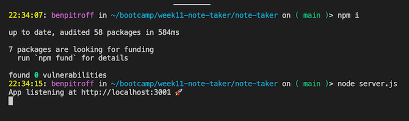
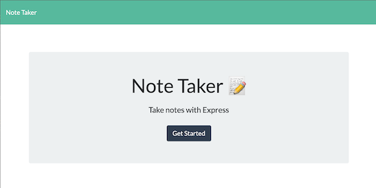
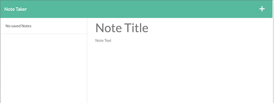

# Note Taker

   [](https://opensource.org/licenses/MIT)

  ## Description
  This project took a pre-built front-end, and added a back-end that allows for the note taking application to make GET, POST, and DELETE requests via express.js, node.js, and npm. The persistant storage is retained in a json file as a pseudo-database.

  * * * * * *


  ## Table of Contents
  1. [Description](#Description)
  2. [Installation](#Installation)
  3. [Usage](#Usage)
  4. [Questions](#questions)
  5. [License](#License)

  * * * * * *

  <a name="Installation"></a>
  ## Installation
  Clone this repo, then run "npm i" to install dependencies

  <a name="Usage"></a>
  ## Usage
  After running "npm i", run "node server.js", then head to localhost:3001 on your browser. Navigate to the Notes page, then type in a Title and a Body and click the Save icon. You can delete and create new notes at will.

  ## [Live page here](https://chicken-note-taker.herokuapp.com)
  
  

  

  

  


  <a name="questions"></a>
  ## Questions
  For any questions, contact me at dev@chicken1991.anonaddy.com and [visit my github profile](https://github.com/chicken1991).

  <a name="License"></a>
  ## License


```md
COPYRIGHT 2022 Ben Pitroff
Permission is hereby granted, free of charge, to any person obtaining a copy of this software and associated documentation files (the "Software"), to deal in the Software without restriction, including without limitation the rights to use, copy, modify, merge, publish, distribute, sublicense, and/or sell copies of the Software, and to permit persons to whom the Software is furnished to do so, subject to the following conditions:

The above copyright notice and this permission notice shall be included in all copies or substantial portions of the Software.

THE SOFTWARE IS PROVIDED "AS IS", WITHOUT WARRANTY OF ANY KIND, EXPRESS OR IMPLIED, INCLUDING BUT NOT LIMITED TO THE WARRANTIES OF MERCHANTABILITY, FITNESS FOR A PARTICULAR PURPOSE AND NONINFRINGEMENT. IN NO EVENT SHALL THE AUTHORS OR COPYRIGHT HOLDERS BE LIABLE FOR ANY CLAIM, DAMAGES OR OTHER LIABILITY, WHETHER IN AN ACTION OF CONTRACT, TORT OR OTHERWISE, ARISING FROM, OUT OF OR IN CONNECTION WITH THE SOFTWARE OR THE USE OR OTHER DEALINGS IN THE SOFTWARE.
```        


[License: MIT](https://opensource.org/licenses/MIT)
